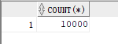
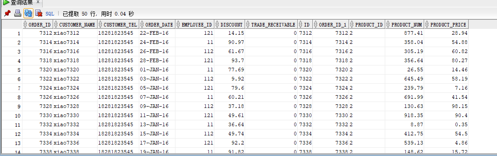

# 实验三


### 创建orders并分区
```sql
  CREATE TABLE orders 
 (
  order_id NUMBER(10, 0) NOT NULL  primary key
  , customer_name VARCHAR2(40 BYTE) NOT NULL 
  , customer_tel VARCHAR2(40 BYTE) NOT NULL 
  , order_date DATE NOT NULL 
  , employee_id NUMBER(6, 0) NOT NULL 
  , discount NUMBER(8, 2) DEFAULT 0 
  , trade_receivable NUMBER(8, 2) DEFAULT 0 
 ) 
 TABLESPACE USERS
 PCTFREE 10 INITRANS 1
 STORAGE (   BUFFER_POOL DEFAULT )
 NOCOMPRESS NOPARALLEL
 PARTITION BY RANGE (order_date)
 (
  PARTITION PARTITION_BEFORE_2017 VALUES LESS THAN (
  TO_DATE(' 2017-01-01 00:00:00', 'YYYY-MM-DD HH24:MI:SS',
  'NLS_CALENDAR=GREGORIAN'))
  NOLOGGING
  TABLESPACE USERS
  PCTFREE 10
  INITRANS 1
  STORAGE
 (
  INITIAL 8388608
  NEXT 1048576
  MINEXTENTS 1
  MAXEXTENTS UNLIMITED
  BUFFER_POOL DEFAULT
 )
 NOCOMPRESS NO INMEMORY
 , PARTITION PARTITION_BEFORE_2018 VALUES LESS THAN (
 TO_DATE(' 2018-01-01 00:00:00', 'YYYY-MM-DD HH24:MI:SS',
 'NLS_CALENDAR=GREGORIAN'))
 NOLOGGING
 TABLESPACE USERS02
  PCTFREE 10
  INITRANS 1
  STORAGE
 (
  INITIAL 8388608
  NEXT 1048576
  MINEXTENTS 1
  MAXEXTENTS UNLIMITED
  BUFFER_POOL DEFAULT
 )
 NOCOMPRESS NO INMEMORY
 , PARTITION PARTITION_BEFORE_2019 VALUES LESS THAN (
 TO_DATE(' 2019-01-01 00:00:00', 'YYYY-MM-DD HH24:MI:SS',
 'NLS_CALENDAR=GREGORIAN'))
 NOLOGGING
 TABLESPACE USERS03
  PCTFREE 10
  INITRANS 1
  STORAGE
 (
  INITIAL 8388608
  NEXT 1048576
  MINEXTENTS 1
  MAXEXTENTS UNLIMITED
  BUFFER_POOL DEFAULT
 )
 NOCOMPRESS NO INMEMORY
 );
```

### 创建 order_datails并分区

```sql
 CREATE TABLE order_details
(
id NUMBER(10, 0) NOT NULL
, order_id NUMBER(10, 0) NOT NULL
, product_id VARCHAR2(40 BYTE) NOT NULL
, product_num NUMBER(8, 2) NOT NULL
, product_price NUMBER(8, 2) NOT NULL
, CONSTRAINT order_details_fk1 FOREIGN KEY  (order_id)
REFERENCES orders  (order_id)
ENABLE
)
TABLESPACE USERS
PCTFREE 10 INITRANS 1
STORAGE (   BUFFER_POOL DEFAULT )
NOCOMPRESS NOPARALLEL
PARTITION BY REFERENCE (order_details_fk1)
(
PARTITION PARTITION_BEFORE_2016
NOLOGGING
TABLESPACE USERS
PCTFREE 10
 INITRANS 1
 STORAGE
(
 INITIAL 8388608
 NEXT 1048576
 MINEXTENTS 1
 MAXEXTENTS UNLIMITED
 BUFFER_POOL DEFAULT
)
NOCOMPRESS NO INMEMORY,
PARTITION PARTITION_BEFORE_2017
NOLOGGING
TABLESPACE USERS02
PCTFREE 10
 INITRANS 1
 STORAGE
(
 INITIAL 8388608
 NEXT 1048576
 MINEXTENTS 1
 MAXEXTENTS UNLIMITED
 BUFFER_POOL DEFAULT
)
NOCOMPRESS NO INMEMORY,
PARTITION PARTITION_BEFORE_2018
NOLOGGING
TABLESPACE USERS03
PCTFREE 10
 INITRANS 1
 STORAGE
(
 INITIAL 8388608
 NEXT 1048576
 MINEXTENTS 1
 MAXEXTENTS UNLIMITED
 BUFFER_POOL DEFAULT
)
NOCOMPRESS NO INMEMORY
);
```
### 分配权限
分配查询权限
```sql
grant select on ORDERS to xqy;
grant select on ORDER_DETAILS to xqy;
```
分配表空间权限
```sql
grant UNLIMITED TABLESPACE to xiaoqingyu;
```

### 向orders和order_details表中插入数据

```sql
declare
  dt date;
  V_EMPLOYEE_ID NUMBER(6);
  v_order_id number(10);
  v_name varchar2(100);
  v_tel varchar2(100);
  v_product_id varchar2(100);
begin
  for i in 1..10000
  loop
    if i mod 2 =0 then
      dt:=to_date('2016-1-1','yyyy-mm-dd')+(i mod 60);
      v_product_id:= '2';
    else if i mod 3=0 then
      dt:=to_date('2017-6-1','yyyy-mm-dd')+(i mod 60);
      v_product_id:='3';
      else
       dt:=to_date('2018-10-1','yyyy-mm-dd')+(i mod 60);
       v_product_id:='1';
       end if;
    end if;
    V_EMPLOYEE_ID:=CASE I MOD 6 WHEN 0 THEN 11 WHEN 1 THEN 111 WHEN 2 THEN 112
                                WHEN 3 THEN 12 WHEN 4 THEN 121 ELSE 122 END;
    v_order_id:=i;
    v_name := 'xiao' || i;
    v_tel := '18281823545';
    --插入订单
    insert  into ORDERS (ORDER_ID,CUSTOMER_NAME,CUSTOMER_TEL,ORDER_DATE,EMPLOYEE_ID,DISCOUNT)
      values (v_order_id,v_name,v_tel,dt,V_EMPLOYEE_ID,dbms_random.value(100,0));
    --插入描述
      insert  into ORDER_DETAILS (ID,ORDER_ID,PRODUCT_ID,PRODUCT_NUM,PRODUCT_PRICE)
      values (v_order_id,v_order_id,v_product_id,dbms_random.value(1000,0),dbms_random.value(100,0));
  end loop;
end;
```
    通过对i的求余判断分配不同的时间段和不同的产品id，将数据存入不同的分区，插入数据为1万条，执行时间 2.196秒。

查询数据匹配条数
```sql
select count(*) from orders a,order_details b where a.order_id=b.order_id;
```
    查询两张表中相匹配数据的条数，因为插入数据时两张表是同时插入，order_details表中的order_id即为当时的orders表的id,
    则查询出数据为1万条。



查询匹配数据
```sql
select * from orders a INNER JOIN order_details b ON (a.order_id=b.order_id);
```


### 执行计划
```sql
EXPLAIN plan for
select * from xiaoqingyu.orders a INNER JOIN xiaoqingyu.order_details b ON (a.order_id=b.order_id);

select * from table(dbms_xplan.display());
```
    由执行结果可知：最先执行的是TABLE ACCESS FULL，意思为对order_details表进行全表扫描。
    然后其次执行的是PARTITION REFERENCE ALL，对分区进行引用。
    然后对orders表进行全表扫描。
    又因为使用了join，所以又进行了NESTED LOOPS连接查询。
    最后将数据查出。
